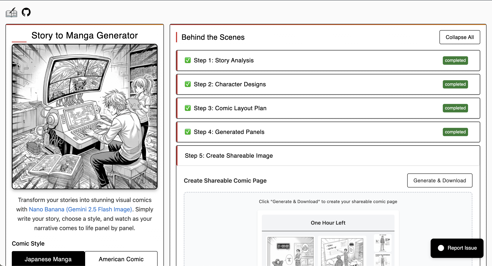
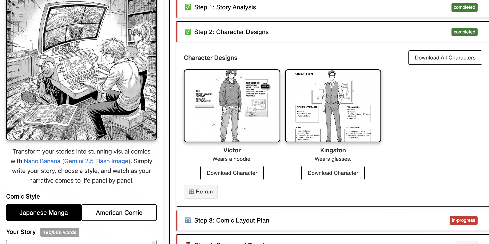
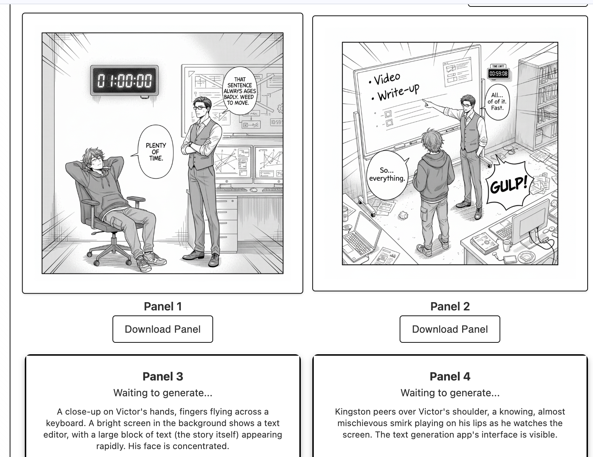

# Story to Manga Machine

Transform your written stories into stunning visual manga or comic book pages using Google's Gemini 2.5 Flash Image API!

**🎨 Try it now at [app.storytomanga.com](https://app.storytomanga.com)**

<!-- <a href="https://www.producthunt.com/products/story-to-manga?embed=true&utm_source=badge-featured&utm_medium=badge&utm_source=badge-story&#0045;to&#0045;manga" target="_blank"></a> -->

*Originally built for the [Nano Banana Hackathon](https://www.kaggle.com/competitions/banana)* 🍌

## Screenshots

<table>
  <tr>
    <td align="center" width="50%">
      
      <br><sub><b>Main Interface</b></sub>
    </td>
    <td align="center" width="50%">
      
      <br><sub><b>Character Design</b></sub>
    </td>
  </tr>
  <tr>
    <td align="center" width="50%">
      
      <br><sub><b>Generation Progress</b></sub>
    </td>
    <td align="center" width="50%">
      
      <br><sub><b>Final Output</b></sub>
    </td>
  </tr>
</table>

## Features

- **Multi-Style Generation**: Choose between Japanese manga or American comic book styles
- **Import from Reddit**: Automatically fetch stories from Reddit by visiting `storytomanga.com/r/<subreddit>/comments/...`
- **Character Consistency**: AI generates character reference sheets and maintains visual consistency across panels
- **Progressive Display**: See character designs first, then comic pages as they're generated
- **State Persistence**: Your work is automatically saved - refresh without losing progress
- **Create Shareable Images**: Generate social media-ready composite images combining panels and character designs
- **Download Support**: Download individual panels or complete comic pages
- **Smart Story Processing**: Automatically analyzes stories, identifies characters, and creates optimal panel layouts

## Tech Stack

- **Frontend**: Next.js 15 with TypeScript and Tailwind CSS v4
- **AI Model**: [Gemini 2.5 Flash Image](https://ai.google.dev/gemini-api/docs/models#gemini-2.5-flash-image-preview)
- **Storage**: Hybrid localStorage (text) + IndexedDB (images) for state persistence
- **Image Export**: HTML2Canvas for social media composite generation
- **Deployment**: AWS Amplify Gen 2

## Try It Online

The easiest way to use Story to Manga is through our hosted version at **[app.storytomanga.com](https://app.storytomanga.com)**. No setup required!

## Local Development Setup

### 1. Install Dependencies

```bash
pnpm install
```

### 2. Get Google AI API Key

1. Visit [Google AI Studio](https://aistudio.google.com/app/apikey)
2. Sign in with your Google account
3. Create a new API key
4. Copy the API key

### 3. Configure Environment

```bash
cp .env.local.example .env.local
```

Edit `.env.local` and add your API key:

```
GOOGLE_AI_API_KEY=your_actual_api_key_here
```

**Optional**: If you want to use a separate API key for text generation (story analysis and chunking), you can also set:

```
GOOGLE_AI_TEXT_API_KEY=your_text_generation_api_key_here
```

If `GOOGLE_AI_TEXT_API_KEY` is provided, it will be used for text generation operations. If not, `GOOGLE_AI_API_KEY` will be used for all operations.

### 4. Run Development Server

```bash
pnpm dev
```

Open [http://localhost:8000](http://localhost:8000) in your browser.

## How It Works

1. **Story Analysis**: Gemini analyzes your narrative to extract characters, settings, themes, and emotional arcs
2. **Character Design**: Generates consistent character reference sheets with detailed visual descriptions
3. **Comic Layout Plan**: Intelligently breaks your story into sequential panels with scene descriptions and dialogue
4. **Panel Generation**: Creates manga/comic panels while maintaining character consistency using reference sheets
5. **Create Shareable Image**: Combine panels and character designs into a 1200x1200px social media-ready image

## Usage

Visit **[app.storytomanga.com](https://app.storytomanga.com)** or run locally:

1. Choose your preferred style (Manga or Comic)
2. Paste your story (max 500 words)
3. Click "Generate Comic"
4. Watch as the AI progressively:
   - Analyzes your story structure
   - Creates character reference sheets
   - Plans the comic layout
   - Generates individual panels
5. Download individual panels or create a shareable composite image

## Importing from Reddit

You can automatically load a story from a Reddit post by going to a URL with the path to the post.

**Example:**
```
https://app.storytomanga.com/r/<subreddit>/comments/...
```

This will load the story from the URL and automatically start the comic generation process.

## Deployment to AWS Amplify

1. Push your code to GitHub
2. Connect your GitHub repo to AWS Amplify
3. Add environment variable `GOOGLE_AI_API_KEY` in Amplify console
4. Deploy automatically on push

## Story Guidelines

**Best Results:**
- 200-500 words
- Clear character descriptions
- Simple, focused plots
- Dialogue-heavy scenes work well

**Avoid:**
- Very complex plots with many characters
- Stories requiring specific visual references
- Adult or inappropriate content

## Troubleshooting

**"Failed to generate character references"**
- Check API key is correct
- Ensure you haven't exceeded rate limits
- Try again in a few minutes

**"Story too long"**
- Reduce story to 500 words or less
- Focus on key scenes and dialogue

**Images not displaying**
- Check browser console for errors
- Ensure stable internet connection
- Try refreshing the page
  
## Contributing

Feel free to submit issues and enhancement requests!

## License

MIT License - feel free to use this for your own projects.
